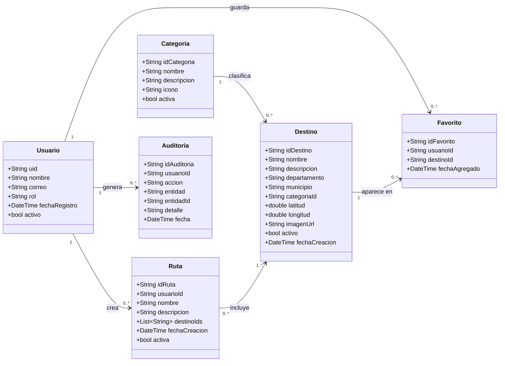

# Diseño de base de datos NoSQL — EcoRuta

## Tipo de base de datos

EcoRuta utiliza **Cloud Firestore**, una base de datos NoSQL orientada a documentos. La información se organiza en colecciones y documentos, utilizando identificadores para relacionar los datos cuando es necesario.

La elección de Firestore permite integrar de forma directa la aplicación Flutter con Firebase Authentication, Firebase Storage y los servicios en la nube utilizados por EcoRuta.

> **Nota técnica:** la rúbrica de la categoría Aficionado menciona 2FN dentro del apartado de diagramación. Las formas normales se aplican formalmente a bases de datos relacionales; al utilizar Firestore, EcoRuta documenta su estructura mediante un diagrama de clases y evita duplicaciones innecesarias usando referencias por identificador.

## Colecciones principales

- `usuarios`
- `categorias`
- `destinos`
- `favoritos`
- `rutas`
- `auditoria`

## Diagrama de clases



## Descripción de las colecciones

### usuarios

Almacena los perfiles de las personas registradas en EcoRuta. El identificador del documento corresponde al `uid` generado por Firebase Authentication.

| Campo | Tipo | Descripción |
|---|---|---|
| `uid` | String | Identificador único del usuario |
| `nombre` | String | Nombre visible del usuario |
| `correo` | String | Correo electrónico |
| `rol` | String | `usuario`, `admin` o `auditor` |
| `fechaRegistro` | Timestamp | Fecha de creación del perfil |
| `activo` | Boolean | Estado de la cuenta |

### categorias

Agrupa los destinos turísticos por tipo.

| Campo | Tipo | Descripción |
|---|---|---|
| `idCategoria` | String | Identificador de la categoría |
| `nombre` | String | Nombre de la categoría |
| `descripcion` | String | Descripción breve |
| `icono` | String | Identificador o recurso visual |
| `activa` | Boolean | Estado de disponibilidad |

### destinos

Contiene la información principal de los destinos turísticos de Nicaragua.

| Campo | Tipo | Descripción |
|---|---|---|
| `idDestino` | String | Identificador del destino |
| `nombre` | String | Nombre del lugar turístico |
| `descripcion` | String | Información descriptiva |
| `departamento` | String | Departamento de Nicaragua |
| `municipio` | String | Municipio donde se encuentra |
| `categoriaId` | String | Referencia a `categorias` |
| `latitud` | Number | Coordenada geográfica |
| `longitud` | Number | Coordenada geográfica |
| `imagenUrl` | String | URL de la imagen principal |
| `activo` | Boolean | Indica si se muestra en la aplicación |
| `fechaCreacion` | Timestamp | Fecha de incorporación |

### favoritos

Registra los destinos guardados por los usuarios.

| Campo | Tipo | Descripción |
|---|---|---|
| `idFavorito` | String | Identificador del registro |
| `usuarioId` | String | Referencia al usuario |
| `destinoId` | String | Referencia al destino |
| `fechaAgregado` | Timestamp | Fecha en que se guardó |

### rutas

Almacena las rutas turísticas creadas por los usuarios.

| Campo | Tipo | Descripción |
|---|---|---|
| `idRuta` | String | Identificador de la ruta |
| `usuarioId` | String | Usuario propietario |
| `nombre` | String | Nombre asignado a la ruta |
| `descripcion` | String | Descripción opcional |
| `destinoIds` | Array<String> | Lista ordenada de destinos incluidos |
| `fechaCreacion` | Timestamp | Fecha de creación |
| `activa` | Boolean | Estado de la ruta |

### auditoria

Registra acciones relevantes del sistema para que el rol Auditor pueda revisarlas.

| Campo | Tipo | Descripción |
|---|---|---|
| `idAuditoria` | String | Identificador del registro |
| `usuarioId` | String | Usuario que realizó la acción |
| `accion` | String | Acción ejecutada |
| `entidad` | String | Tipo de recurso afectado |
| `entidadId` | String | Identificador del recurso afectado |
| `detalle` | String | Resumen del cambio |
| `fecha` | Timestamp | Fecha y hora de la acción |

## Relaciones lógicas

- Una **categoría** puede clasificar muchos destinos, mientras que cada destino pertenece a una categoría principal.
- Un **usuario** puede guardar muchos destinos como favoritos.
- Un mismo **destino** puede aparecer en los favoritos de distintos usuarios.
- Un **usuario** puede crear múltiples rutas.
- Una **ruta** contiene uno o más destinos mediante la lista `destinoIds`.
- Un **usuario** puede generar múltiples registros de auditoría dependiendo de las acciones realizadas.

## Ejemplo de estructura en Firestore

```text
usuarios/
  {uid}/
    nombre
    correo
    rol
    fechaRegistro
    activo

categorias/
  {idCategoria}/
    nombre
    descripcion
    icono
    activa

destinos/
  {idDestino}/
    nombre
    descripcion
    departamento
    municipio
    categoriaId
    latitud
    longitud
    imagenUrl
    activo
    fechaCreacion

favoritos/
  {idFavorito}/
    usuarioId
    destinoId
    fechaAgregado

rutas/
  {idRuta}/
    usuarioId
    nombre
    descripcion
    destinoIds[]
    fechaCreacion
    activa

auditoria/
  {idAuditoria}/
    usuarioId
    accion
    entidad
    entidadId
    detalle
    fecha
```

## Reglas de diseño

- Los identificadores de Firebase Authentication se reutilizan para vincular perfiles de usuario.
- Las relaciones se realizan mediante IDs para evitar almacenar copias completas de otros documentos.
- Los datos que cambian con frecuencia se mantienen en documentos independientes.
- Los roles se almacenan en el perfil del usuario y deben reforzarse mediante reglas de seguridad de Firestore.
- Las imágenes se almacenan en Firebase Storage y Firestore conserva únicamente sus URLs o referencias.
